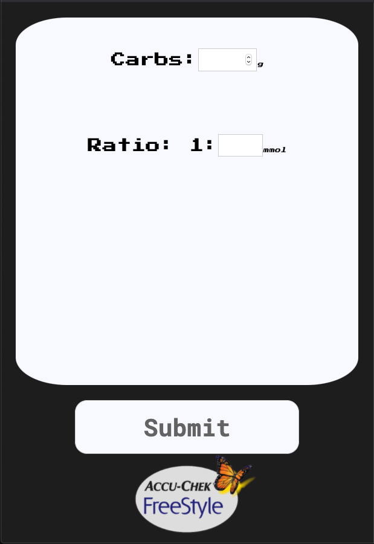
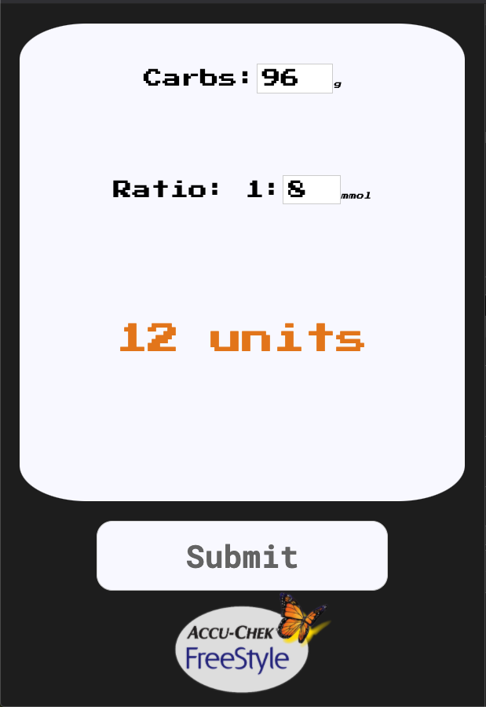

# Glucometer





## Local Setup

```sh
$ git clone https://github.com/kealanheena/glucometer.git
```

```sh
$ cd react-calculator
```

```sh
$ npm install
```

## Run Locally

```sh
$ npm start
```

## Run Tests

```sh
$ npm test
```
